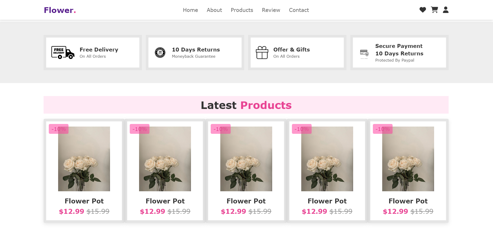

## FlowerShop Website
## Table of contents
* [General info](#general-info)
* [Technologies](#technologies)
* [Pictures](#pictures)
## General info
This project is a fully responsive and visually appealing FlowerShop website built using HTML, CSS, and JavaScript. The website is designed to provide users with a smooth experience while browsing through various flower categories and placing orders online.

Features
Home Page: A welcoming homepage that displays featured products and promotions.
Shop: A detailed product listing page with different categories like roses, bouquets, and more.
Product Details: Individual product pages with detailed descriptions, images, and pricing.
Cart: A user-friendly shopping cart where customers can review their selected items before checkout.
Contact: A contact form for customers to get in touch or ask questions.
Responsive Design: The site is fully responsive and works seamlessly on desktops, tablets, and mobile devices.

## Technologies
Project is created with:
*  Html
*  Css
*  Javascript

## Pictures
*
*
*
*
*
